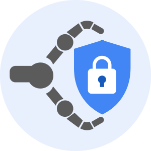

# shieldgrabber
Firefox extension to grab Google Meet blue shield (host controls) before the meeting creator

	

# Getting started
## Installation
Official AMO (Addons Mozilla Org) url: https://addons.mozilla.org/en-US/firefox/addon/blue-shield-grabber/

Otherwise install this extension from local settings. 
First of all, disable signatures check: `about:config` -> turn _xpinstall.signatures.required_ into `false`.
Then, go to `about:addons` -> gear icon -> _Install Add-on From File..._ -> Pick the `.zip` package

## Settings
You can change default user id from `about:addons` page. Click on the three dots, then _Preferences_. Change _Google user id_ value with the id corresponding to your preferred account, according to the one you want to use during auto-login process. Once the input box is updated, press _Save_ button.

# Usage
In order to grab the blue shield before the others, you have to open the homepage of the Classroom's class you want to fool. Once it is loaded, click on the ShieldGrabber icon at the top of your screen (in the menu bar), press the blue button, and refresh the page. Then, keep Google Classroom webpage open and wait until your teacher renews GMeet link. 

# Disclaimer
This Firefox addon is indended for academic and educational purposes only. We take no responsibility for any usage other than those specified.
